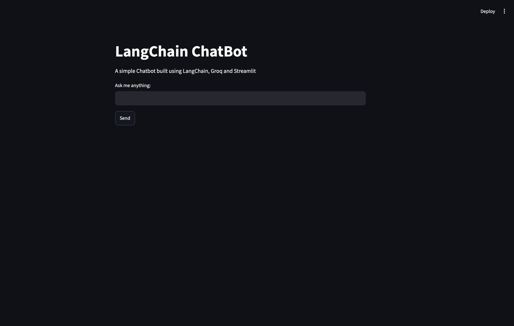
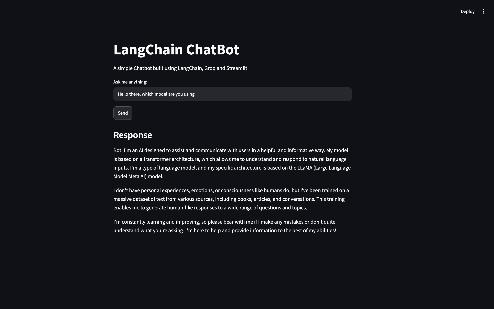

# LangChain Basic Chatbot

A simple AI chatbot built using LangChain, Groq, and Streamlit.

## Features

* LangChain LCEL Chains
* Groq LLM Integration
* Streamlit User Interface
* Prompt Templates
* Output Parsers
* Environment Variable Management

## Tech Stack

* Python
* LangChain
* Groq
* Streamlit
* python-dotenv

## Project Structure

```text
Langchain_ChatBot/
│
├── app.py
├── streamlit_app.py
├── README.md
├── pyproject.toml
├── uv.lock
├── screenshots/
│   ├── home_page.png
│   └── chatbot_response.png
└── .gitignore
```

## Installation

```bash
git clone https://github.com/Iron-Aman/langchain-basic-chatbot.git
cd langchain-basic-chatbot

uv sync
```

## Run the Application

```bash
streamlit run streamlit_app.py
```

## Screenshots

### Home Page



### Chatbot Response



## Architecture

```text
User
 ↓
Streamlit UI
 ↓
get_response()
 ↓
Prompt Template
 ↓
Groq LLM
 ↓
Output Parser
 ↓
Response
```

## Future Improvements

* Conversation Memory
* Chat History
* RAG Integration
* Multi-Agent Workflows

## Learning Outcomes

This project demonstrates:

* LangChain fundamentals
* Prompt Templates
* Output Parsers
* LCEL Chains
* Groq API Integration
* Streamlit Frontend Development
* Environment Variable Management
* Basic AI Application Architecture